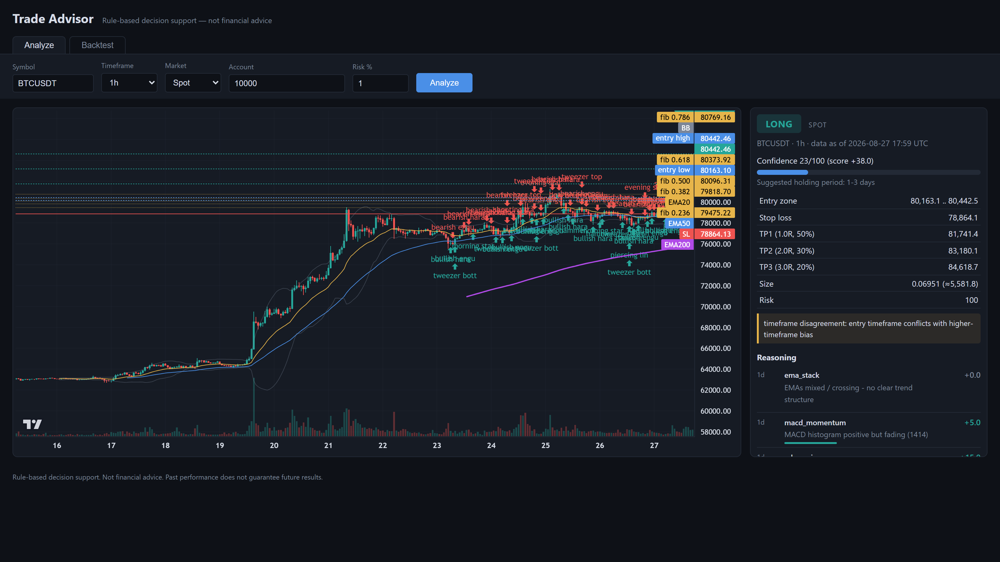
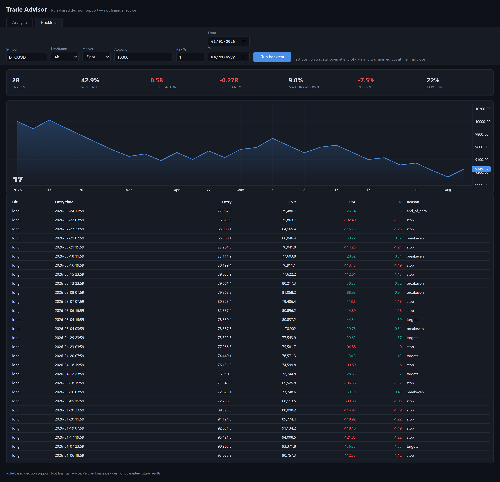
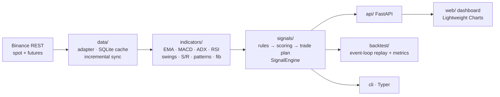

# Trade Advisor


Rule-based crypto trade advisory tool for **spot and USDT-M futures**. Ask it
about a coin and it fetches live + historical Binance data, runs
multi-timeframe technical analysis (indicators, candlestick patterns,
support/resistance, Fibonacci), and produces a trade recommendation:
direction (long / short / **no trade**), suggested holding period, entry
zone, stop loss, take-profit targets, fixed-risk position size (with the
leverage a futures position would need), a confidence score — and the full
reasoning trail showing which rules fired and what each contributed.

> **This is decision support, not financial advice.** No indicator system
> reliably predicts markets. What this tool gives you is consistency,
> risk discipline, and a backtester to falsify rule ideas before you trust
> them. "No trade" is a first-class answer. It never places orders.

<!-- Screenshots: run `tadvisor serve`, capture the dashboard (chart +
     recommendation card) and the backtest tab, save to docs/screenshots/,
     then uncomment these lines:


-->


## Highlights

- **Explainable by design** — every recommendation ships with the scored
  reasoning trail: which rules fired, on which timeframe, worth how many points.
- **One engine, live and backtested** — the backtester replays the exact
  `SignalEngine.analyze()` used for live advice; divergence is impossible by
  construction, and a dedicated test proves no lookahead.
- **Honest numbers** — pessimistic fills (stop wins ties), fees + slippage on
  every side, swing points hidden until they'd actually be visible.
- **Full risk plan, not just a signal** — ATR-based stops sanity-checked
  against structure, 1R/2R/3R targets that snap to S/R or Fibonacci
  extensions, and fixed-risk position sizing (with required leverage for futures).

## Architecture



## Setup

```powershell
cd trade-advisor
python -m venv .venv
.venv\Scripts\activate
pip install -e ".[dev]"
```

Optionally copy `.env.example` to `.env` and adjust. If Binance returns
HTTP 451 (geo-blocked in your region), set:

```
TADVISOR_BINANCE_BASE_URL=https://data-api.binance.vision
```

(The tool also tries this mirror automatically as a fallback.)

## Usage

```powershell
# backfill the local candle cache (optional; analyze does this on demand)
tadvisor fetch BTCUSDT

# analyze: prints direction, entry zone, SL, TPs, sizing + reasoning
tadvisor analyze BTCUSDT --tf 1h --account 10000 --risk 1
tadvisor analyze BTCUSDT --tf 4h --market futures --raw   # futures + fib/S-R dump

# backtest the exact same engine over history
tadvisor backtest BTCUSDT --tf 4h --start 2026-01-01                  # spot (long-only)
tadvisor backtest BTCUSDT --tf 4h --market futures --start 2026-01-01 # long + short

# web dashboard (chart + recommendation card + backtest tab)
tadvisor serve            # -> http://127.0.0.1:8000
```

Entry timeframes: `15m`, `1h`, `4h`, `1d`. Each entry timeframe is judged
against a higher **bias** timeframe (trend) and a **context** timeframe
(confirmation): 15m→4h/1h, 1h→1d/4h, 4h→1d, 1d→1w.

## How a recommendation is produced

1. **Bias timeframe (weight 40):** EMA 20/50/200 stack, MACD histogram,
   ADX regime. ADX < 20 flags the market as choppy and can veto the trade.
2. **Context timeframe (weight 20):** price vs EMA50, RSI regime.
3. **Entry timeframe (weight 48):** RSI pullback in trend direction,
   stochastic cross, proximity to detected support/resistance, **Fibonacci
   confluence** (pullback into the 50–61.8% golden pocket of the most recent
   swing leg scores highest; a retracement beyond 78.6% counts against),
   candlestick confirmation, volume confirmation.

Candlestick patterns detected (all exact, testable definitions): bullish /
bearish engulfing, hammer, shooting star, morning / evening star, bullish /
bearish harami, piercing line, dark cloud cover, three white soldiers,
three black crows, tweezer top / bottom, doji.

Total score ≥ +30 → long, ≤ −30 → short, otherwise no trade. The trade plan
uses an ATR-based stop (min 1.5×ATR, beyond the nearest confirmed swing,
max 3×ATR or the trade is skipped), take-profits at 1R/2R/3R — TP3 snaps to
the nearest major S/R level **or Fibonacci extension (1.272 / 1.618)** beyond
2R — and position size = account × risk% ÷ stop distance.

## Spot vs futures

| | Spot | Futures (USDT-M perpetuals) |
|---|---|---|
| Data source | api.binance.com (mirror fallback) | fapi.binance.com |
| Directions | Long only — a bearish signal is shown but produces no plan (you can't short spot; it means "stay out / take profit") | Long and short |
| Sizing | No leverage: size is capped at the account, with the reduced actual risk shown | Full risk-based size, with the leverage required (~x) and a liquidation-risk warning |
| Backtests | Long-only replay | Long + short replay |

## Per-timeframe tuned profiles

Engine parameters (entry threshold, ADX chop filter, stop width) are defined
in `EngineParams` (src/tradeadvisor/signals/engine.py) with per-timeframe
profiles in `PARAMS_BY_TF`, applied identically to live analysis and
backtests. Reproduce or extend the tuning with `scripts/sweep_15m.py`
(train/validation split — never pick a config on validation numbers).

**15m profile** (tuned on BTC/ETH futures Jan–Apr 2026, validated
out-of-sample on May–Aug 2026 plus SOL, futures cost model 0.045%/0.02%):
threshold 55, ADX ≥ 25, stops ≥ 2.5×ATR. Validation: expectancy improved
from −0.26R (defaults) to −0.10R and max drawdown from ~75% to ~17% — a
large improvement, **but 15m never reached positive expectancy**. Every 15m
recommendation carries a warning saying so. Prefer 4h/1d.

## Backtester honesty rules

- Same `SignalEngine.analyze()` as live — zero divergence by construction.
- Signals fire on closed candles only; fills happen next bar at the earliest.
- Swing points only become visible k bars after they form (no repainting).
- If a candle touches both stop and take-profit, the stop is counted (pessimistic).
- Every fill pays fees (0.1%) and slippage (0.05%) per side.

A test (`tests/test_signals.py::test_lookahead_guard_prefix_vs_full_slice`)
asserts that analyzing a data prefix directly is identical to the
backtester's enrich-once-then-slice fast path — the standard way lookahead
bugs sneak into backtests.

## Verifying against TradingView

Open the same symbol on TradingView with the **Binance** feed, add RSI(14),
EMA(20/50/200) and Bollinger(20,2), and compare with the chart overlays at
`http://127.0.0.1:8000` and the values cited in the reasoning trail. Values
should match to within rounding once ~200 bars of warmup exist. Detected
S/R levels should sit on visually obvious swing clusters.

## Tests

```powershell
pytest
```

## Project layout

```
src/tradeadvisor/
  data/        Binance adapter, SQLite candle cache, incremental sync
  indicators/  indicator enrichment, swing/S-R detection, candle patterns
  signals/     rules -> scoring -> trade plan -> SignalEngine
  backtest/    event-loop replay + metrics
  api/         FastAPI routes (health, symbols, klines, analyze, backtest)
web/           dashboard (vanilla JS + Lightweight Charts, no build step)
tests/         58 tests incl. the lookahead guard and pessimistic-fill rules
```
